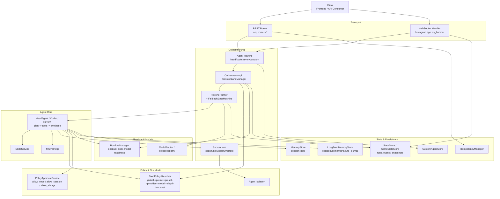

# Backend Architecture

Stand: 2026-03-04  
Scope: Nur Backend (`backend/`), Frontend ist bewusst nicht Teil dieses Dokuments.

## 1. Zielbild

## Was es ist

Dieses Backend ist ein orchestriertes Agent-Framework mit klar getrennten Laufzeit- und Steuerungspfaden.

- Verarbeitet Prompts über REST und WebSocket.
- Führt Agent-Läufe deterministisch über Pipeline-Schritte aus.
- Unterstützt Multi-Agent-Routing (Head/Coder/Review + Custom Agents).
- Unterstützt Child-Runs/Subruns mit Tiefen-, Sichtbarkeits- und Isolationsregeln.
- Bietet eine Control-Plane für Runs, Sessions, Workflows, Tools/Policies, Skills und Diagnose.
- Unterstützt lokale und API-basierte Modellruntimes inklusive Runtime-Feature-Flags.

## Was es nicht ist

- Kein autonomer Hintergrund-Agent ohne Anfrage.
- Kein vollständig autonomes Langzeitgedächtnis mit eigener Zielverfolgung.
- Kein Frontend-System.

---

## 2. Architektur auf hoher Ebene

Die Anwendung ist eine FastAPI-App mit modularen Schichten:

1) **Transport/API**
- REST-Router in `app.routers/*`, Wiring über `app.main` + `app.control_router_wiring`.
- WebSocket-Endpunkt `GET /ws/agent`, Logik in `app.ws_handler`.
- Typed Inbound-Envelope/Union in `app.models`.

2) **Agent- und Orchestrierungs-Schicht**
- AgentContracts über Adapter (`app.agents.head_agent_adapter`), delegieren auf `HeadAgent`/`CoderAgent`/`ReviewAgent` (`app.agent`).
- `OrchestratorApi` serialisiert pro Session über `SessionLaneManager`.
- `PipelineRunner` mit Model-Routing, Context-Window-Guard und Fallback-State-Machine.
- `SubrunLane` für Child-Execution inkl. Persistenz/Restore und Visibility.

3) **Runtime- und Modell-Schicht**
- `RuntimeManager` steuert `local`/`api`, Modellauflösung, Gateway-Start, Auth-Guard.
- `ModelRouter` + Registry wählen Primary/Fallback inkl. Adaptive-Inference-Budgeting.

4) **Persistenz- und Zustands-Schicht**
- Run-State: `StateStore` (Datei) oder `SqliteStateStore` (SQLite; wählbar via `ORCHESTRATOR_STATE_BACKEND`).
- Session-Memory: `MemoryStore` (JSONL).
- Long-Term-Memory: SQLite (`episodic`, `semantic`, `failure_journal`) über `LongTermMemoryStore`.
- Custom Agents/Workflows: dateibasiert.
- Policy-Approval-`allow_always`-Regeln: persistiert als JSON.
- Idempotency: zentral, in-memory, bounded per TTL+Capacity.

5) **Policy-, Guardrail- und Isolation-Schicht**
- Tool-Policy-Auflösung in Layern (`resolve_tool_policy` / `tool_policy_service`).
- Persistente und Session-basierte Policy-Approvals (`PolicyApprovalService`).
- Agent-Isolation (`agent_isolation`) erzwingt Scope-Regeln für Delegation/Subruns.
- Guardrails für Input, Tools, Context-Window, Queue-Overflow, Subrun-Depth und Agent-Depth.

6) **Skills- und Erweiterungs-Schicht**
- Skills-Discovery/Eligibility/Snapshot in `app.skills/*`.
- MCP-Bridge optional (`mcp_enabled`) als dynamische Tool-Erweiterung.
- Hook-Contract-v2-Infrastruktur für Lifecycle-Hooks.

### 2.1 Architekturübersicht (Mermaid)

---

## 3. Laufzeitmodell und Lifecycle

- FastAPI-Aufbau über `app.app_setup` (`build_fastapi_app`, CORS, Lifespan).
- Startup/Shutdown über `app.startup_tasks` (inkl. optionales Cleanup und Task-Abbruch).
- Runtime-Komponenten werden lazy über `LazyRuntimeRegistry` (`app.app_state`) gebaut.
- Vorteile:
  - geringere Import-Time-Side-Effects,
  - reproduzierbares Boot-Verhalten,
  - bessere Testbarkeit/DI.

---

## 4. Kernkomponenten im Detail

### 4.1 `app.main`

`main.py` ist primär Kompositions- und Wiring-Schicht:

- baut Runtime-Komponenten (`RuntimeComponents`) lazy,
- registriert Basis-Agenten (`head-agent`, `coder-agent`, `review-agent`) als Adapter,
- erstellt Orchestrator pro Agent,
- synchronisiert Custom Agents in Registry/Orchestrator-Map,
- bindet Subrun-Spawn-Handler und Policy-Approval-Handler in Agenten,
- integriert modulare Router inkl. Control-Plane.

Wichtig: Die domänenspezifische API-Logik liegt überwiegend in `app.handlers/*`, nicht in `main.py`.

### 4.2 `app.ws_handler`

`ws_handler` ist der vollständige WS-Controller für `/ws/agent`:

- Sequenced Event-Envelopes (`seq`).
- Unterstützte Inbound-Typen:
  - `user_message`
  - `clarification_response`
  - `runtime_switch_request`
  - `subrun_spawn`
  - `policy_decision`
- Queue- und Follow-up-Steuerung je Session über `SessionInboxService`.
- Queue-Modes: u. a. `wait`, `follow_up`, `steer`.
- Directive-Parsing aus Nachrichtentext (Modell/Reasoning/Queue-Overrides).
- Dynamisches Agent-Routing (Capability-basiert + Preset-/Intent-Signale).
- Konsistentes Error-Mapping auf Lifecycle- und Error-Events.

### 4.3 `app.agent` (`HeadAgent` + spezialisierte Rollen)

`HeadAgent` bildet den zentralen Determinismus-Kern:

1. Guardrails + Policy-Validierung  
2. Toolchain-Check  
3. Memory/Context-Reduction  
4. Planning  
5. Tool-Selection + Tool-Execution (mit Replan-Loops)  
6. Synthesis + optional Reflection  
7. Reply-Shaping + Verification + Final Event

Relevante Erweiterungen im Ist-Stand:

- Clarification-Protocol (`clarification_needed`) bei Ambiguität.
- Verification-Punkte für Plan/Tools/Final.
- Root-Cause-Replanning und reason-kodierte Replan-Lifecycle-Stages.
- Tool-Loop-Detektoren (`generic_repeat`, `ping_pong`, `poll_no_progress`).
- Long-Term-Memory-Nutzung (Failure-Retrieval + Semantic Facts).
- Session-Distillation nach erfolgreichen Runs in episodic/semantic Store.
- Failure-Journal-Eintrag bei Fehlerpfad.
- Optionaler MCP-Tool-Import.

### 4.4 `app.interfaces.orchestrator_api` + `app.orchestrator/*`

`OrchestratorApi`:

- emittiert Queue/Lane-Lifecycle,
- löst Tool-Policy kontextsensitiv auf (preset/provider/model/agent_depth/request/also_allow),
- führt den Run in einer Session-Lane aus.

`PipelineRunner`:

- setzt/trackt Pipeline-Task-Status,
- führt Model-Routing inkl. adaptive inference budgets aus,
- erzwingt Context-Window-Guard,
- kapselt Fallback/Recovery in `FallbackStateMachine`.

`FallbackStateMachine`:

- explizite Zustandsmaschine für Retry/Fallback/Recovery,
- reason-basierte Recovery-Branches,
- Metrik-/Summary-Emission und optionales Backoff.

`run_state_machine.py` + `run_handlers`:

- leiten aus Lifecycle-Stages strukturierte `stage_event` und `run_state_event` ab,
- validieren erlaubte State-Transitions,
- erzeugen bei Verletzungen `run_state_violation` (optional hard-failbar via Config).

### 4.5 `app.orchestrator.subrun_lane`

- kontrolliert Child-Runs über Semaphore + Limits:
  - max concurrent,
  - max depth,
  - max children/parent.
- unterstützt Spawn-Modi (`run`/`session`) und Session-Tree-Sichtbarkeit (`self`/`tree`/`agent`/`all`).
- persistiert Registry (`subrun_registry.json`) und restauriert bei Neustart.
- führt optional Orphan-Reconciliation nach Restore durch.

### 4.6 `app.runtime_manager`

- Runtime-Switch mit Retry+Rollback.
- Modellauflösung (`ensure_model_ready`, `resolve_api_request_model`).
- API-Auth-Guard (`API_AUTH_REQUIRED`, Token/Key).
- Persistiert Runtime-Zustand inkl. Feature-Flags (`runtime_state.json`).

### 4.7 Persistenz (`app.state`, `app.memory`, `app.custom_agents`, LTM)

- `StateStore`: dateibasierte Run-JSONs + Snapshots + String-Transform (Redaction/Truncation).
- `SqliteStateStore`: optionale SQLite-Variante mit `runs`-Tabelle, WAL, sortierte `list_runs`.
- `MemoryStore`: JSONL je Session (kurzfristiger Dialogkontext).
- `LongTermMemoryStore`: SQLite mit Tabellen
  - `episodic`
  - `semantic`
  - `failure_journal`
- `CustomAgentStore`: Dateibasierte CRUD für Workflows/Custom Agents.

### 4.8 Konfiguration (`app.config`)

Schwerpunkte:

- Runtime/Storage: `ORCHESTRATOR_STATE_BACKEND`, `ORCHESTRATOR_STATE_DIR`, `RUNTIME_STATE_FILE`.
- Queueing/Prompting: `QUEUE_MODE_DEFAULT`, `PROMPT_MODE_DEFAULT`, Session-Inbox-Limits.
- Safety: Command-Allowlist, Tool-Guards, Context-Window-Guard.
- Recovery/Fallback: fein-granulare `PIPELINE_RUNNER_*` Flags.
- Skills-Engine + Canary.
- Reflection/Clarification/Structured Planning.
- Long-Term-Memory, Session-Distillation, Failure-Journal.
- Strikte Config-Validierung für unbekannte Keys (optional).

### 4.9 Skills + Diagnose-Endpunkte

Skills-Endpunkte:

- `POST /api/control/skills.list`
- `POST /api/control/skills.preview`
- `POST /api/control/skills.check`
- `POST /api/control/skills.sync`

Zusätzliche Diagnose-/Observability-Endpunkte (Control-Plane):

- `POST /api/control/context.list`
- `POST /api/control/context.detail`
- `POST /api/control/config.health`
- `POST /api/control/memory.overview`

Diese Endpunkte liefern Token-/Segment-Schätzungen, Config-Risikoflags und Memory-/LTM-Übersichten.

---

## 5. API-Oberfläche (Backend)

## WebSocket

- `GET ws /ws/agent`

Inbound:

- `user_message`
- `clarification_response`
- `runtime_switch_request`
- `subrun_spawn`
- `policy_decision`

Outbound-Klassen (Auszug):

- `status`, `final`, `error`, `lifecycle`
- `clarification_needed`
- `policy_approval_required`, `policy_approval_updated`
- `runtime_switch_progress`, `runtime_switch_done`, `runtime_switch_error`
- `subrun_status`, `subrun_announce`

## REST (Core)

- `GET /api/runtime/status`
- `GET /api/debug/prompts/resolved`
- `GET /api/monitoring/schema`
- `GET /api/test/ping`
- `POST /api/test/agent`
- `POST /api/runs/start`
- `GET /api/runs/{run_id}/wait`
- `GET /api/agents`
- `GET /api/presets`
- `GET /api/custom-agents`
- `POST /api/custom-agents`
- `DELETE /api/custom-agents/{agent_id}`
- `GET /api/subruns`
- `GET /api/subruns/{run_id}`
- `GET /api/subruns/{run_id}/log`
- `POST /api/subruns/{run_id}/kill`
- `POST /api/subruns/kill-all`

## Control-Plane (modular)

Gruppen:

- Runs: `/api/control/run.*`, `/api/control/agent.*`, `/api/control/runs.*`
- Sessions: `/api/control/sessions.*`
- Workflows: `/api/control/workflows.*`
- Tools/Policy: `/api/control/tools.*`, `/api/control/tools.policy.*`
- Policy Approvals: `/api/control/policy-approvals.*`
- Skills: `/api/control/skills.*`
- Diagnose: `/api/control/context.*`, `/api/control/config.health`, `/api/control/memory.overview`

Idempotency:

- Write-/Execute-Endpunkte nutzen `Idempotency-Key` (Header + Payload-Fingerprint).
- Registry ist TTL- und Capacity-bounded.

---

## 6. Policy-, Sicherheits- und Guardrail-Modell

Tool-Policy-Layer (Reihenfolge):

1. global
2. profile
3. preset
4. provider
5. model
6. agent_depth
7. request

Regeln:

- `deny` überschreibt effektive Nutzung.
- `also_allow` wirkt additiv, aber nur für bekannte Tools.
- unbekannte Tool-Namen erzeugen Explain-/Warning-Informationen.

Agent-/Depth-spezifisch:

- `spawn_subrun` wird in tiefen Ebenen bzw. bei Nicht-Orchestrator-Agenten per Layer entzogen.
- optionale Leaf-Spawn-Depth-Guard in `SubrunLane`.

Weitere Schutzmechanismen:

- Input-/Session-/Model-Guardrails.
- Command-Allowlist und Tool-Argument-Validierung.
- Queue-Overflow-Guardrails.
- Agent-Isolation (Scope-Pair-Allowlist).
- Persistente Secret-Redaction im State-Transform.
- API-Runtime-Auth-Guard.

---

## 7. Datenhaltung und Artefakte

Standardpfade (env-konfigurierbar):

- Memory (short-term): `MEMORY_PERSIST_DIR/*.jsonl`
- Long-term DB: `LONG_TERM_MEMORY_DB_PATH`
- Run-State: `ORCHESTRATOR_STATE_DIR/runs/*.json` (bzw. SQLite-DB bei Backend=`sqlite`)
- Snapshots: `ORCHESTRATOR_STATE_DIR/snapshots/*.summary.json`
- Runtime-State: `RUNTIME_STATE_FILE`
- Custom Agents: `CUSTOM_AGENTS_DIR/*.json`
- Subrun-Registry: `ORCHESTRATOR_STATE_DIR/subrun_registry.json`
- Policy allow-always Regeln: `ORCHESTRATOR_STATE_DIR/policy_allow_always_rules.json`
- Skills-Quelle: `SKILLS_DIR`

---

## 8. Modell- und Runtime-Strategie

Runtimes:

- `local`
- `api`

Routing/Fallback:

- Primary + fallback chain via `ModelRouter`.
- Failover-Reason-Klassifikation (`context_overflow`, `timeout`, `rate_limited`, ...).
- Retryability-Entscheidungen + Recovery-Strategie-Resolver.
- Adaptive Inference (Kosten-/Latenzbudget) kann Primary degradieren.

---

## 9. Beobachtbarkeit und Testbarkeit

Beobachtbarkeit:

- strukturierte Logs für WS/Runtime/Fallback/Shutdown,
- dichte Lifecycle-Events über Plan, Tool, Synthesis, Recovery, Queue und Policy,
- abgeleitete Audit-Events (`stage_event`, `run_state_event`, optional `run_state_violation`),
- Diagnoseendpunkte für Kontext, Config-Hygiene und Memory-Zustand.

Testbarkeit:

- breite Unit-/Integrations-/E2E-Abdeckung unter `backend/tests/`,
- dedizierte Suiten für WS, Subruns, Policy, Recovery-State-Machine, MCP, Security-Guards,
- lokale Vollsuite wurde zuletzt erfolgreich ausgeführt (siehe Projektkontext).

---

## 10. Benchmarking

Szenariobasierte WS-Benchmark-Pipeline:

- Runner: `benchmarks/run_benchmark.py`
- Levels: `easy`, `mid`, `hard`
- Szenarien: `benchmarks/scenarios/default.json`
- Artefakte: `monitoring/benchmarks/<timestamp-uuid>/` (`summary.md`, `results.json`, `*.events.jsonl`)

---

## 11. Bekannte Grenzen / technische Schulden

1) `main.py` bleibt als Wiring-Datei umfangreich trotz Handler-Auslagerung.  
2) `HeadAgent` bleibt ein großer Integrationsknoten (Planning/Tools/Synthesis/Memory/Hooks).  
3) Idempotency ist nicht persistent über Prozessneustarts.  
4) Dateibasierte State-Variante skaliert begrenzt bei sehr großen Run-Mengen (SQLite mildert, ersetzt aber keine vollwertige Query-Engine).  
5) RuntimeManager bündelt weiterhin mehrere Verantwortungen (Process, Auth, Modellverfügbarkeit, Feature-Flags).

---

## 12. Architekturprinzipien für weitere Änderungen

- Keine API-Breaks an bestehenden REST-/WS-Verträgen.
- Klare Trennung von Wiring (`main`) und Domänenlogik (`handlers`, `services`, `orchestrator`).
- Policies/Guardrails zentral halten (Single Source of Truth).
- Zustands- und Lifecycle-Kontrakte stabilisieren (inkl. Run-State-Machine).
- Kleine, testgetriebene Refactor-Schritte mit Contract-Regressionen.
- Komplexität in `HeadAgent` und `RuntimeManager` weiter modularisieren, ohne Laufzeitverhalten zu destabilisieren.
